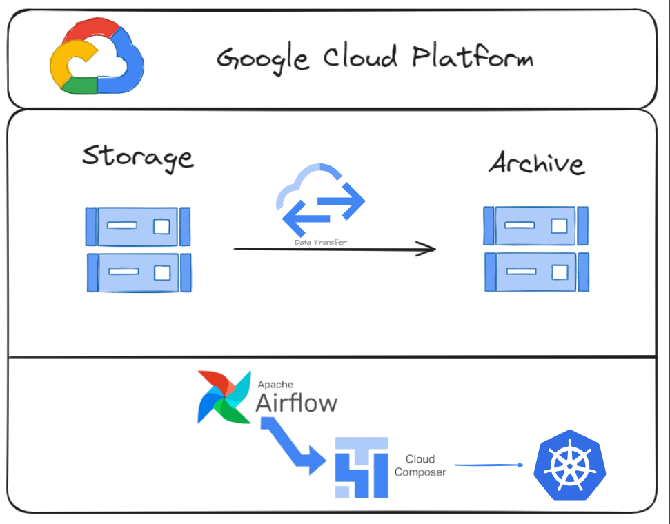

# Process Scheduling With Composer

## About
O projeto consiste em orquestrar a movimentação de arquivos entre dois buckets no GCS, utilizando o Composer (Airflow gerenciado pela Google Cloud Platform) em conjunto com recursos executados em GKE para suportar tarefas específicas do fluxo.

## Developer
[Thadeu Guimarães](www.linkedin.com/in/thadeu-guimarães)